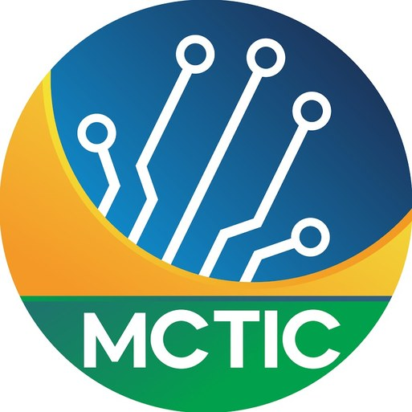
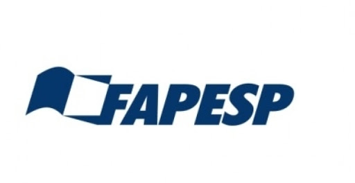

# telcom-unisinos-project.github.io

<table>
  <tbody>
    <tr>
      <td>   </td>
      <td>   </td>
      <td> </td>  
    </tr>
  </tbody>
</table>

<table>
  <tbody>
    <tr>
      <td><a href="#description">Description</a></td>
      <td><a href="#members">Members</a></td>
      <td><a href="#publications">Publications</a></td>
      <td><a href="#development">Development</a></td>
      <td><a href="#news">News</a></td>
      <td><a href="#partners">Partners</a></td>
      <td><a href="#acknowledgement">Acknowledgement</a></td>
    </tr>
  </tbody>
</table>

## Description

The expected massive growth of mobile Internet traffic in 5G mobile networks introduces the need to change the operators’ networks. Such networks require a drastic transformation towards open, scalable and elastic ecosystems supporting new types of communication. The PORVIR-5G project will develop and demonstrate a programmable fronthaul and backhaul integrating wireless with optical-packet networks and cloud solutions. It is intended to exploit virtual network splits that optimise resource allocation across the wireless, optical, packet, and compute/storage domains. Key enablers for PORVIR-5G are (i) Slicing over packet, wireless, and optical resources, controlled by (ii) deep programmability interfaces, where the devices are configured by network functions to provide the required performance for the future applications on the Internet. This programmability allows a more refined (iii) end-to-end and multilayer orchestration, considering the quality of experience of the users for each type of applications over the network. This project will validate and demonstrate the proposed programmability and virtualization capabilities in three demonstrations, each one of them enabling the key performance demands of 5G networks: an Internet of Things demonstrator focusing on massive machine-type communication; a smart city demonstration for reliable and ultra-low latency flows; and a high bandwidth video demonstrator showcasing the next-generation mobile broadband. 

## Members
 </table>
   <tbody>
        > Group Faculty of Department and Graduate Students</legend>

            Permanent Faculty and Graduate Students
            

               
<tr>
    <td height="253">

      
<strong>Prof. Dr. Cristiano Bonato Both</strong>

      
<strong> Ph.D </strong>
      
Chairperson /  Professor 
</td>
</tr>
    <td width="26%" height="253">

      
<strong>Prof. Dr. Lucio Rene Prade</strong>

      
<strong> Ph. D </strong>

      
Professor
</td>
  
      <td width="24%" height="253">

      
<strong>Mr.Ariel Dalla Costa</strong>

      
<strong>B.Sc. M. Sc. Computer Science</strong>
      
Ph.D. Student
</td>
 
  
    <td width="24%" height="253">
<

      
<strong>M. Sc. Gustavo Zanatta Bruno </strong>

      
<strong>B.Sc. Computer Engineering </strong>

      
<strong>Ph.D Student </strong>

      
Visiting Virginia Tech (2023)
</td>
  </tr>
      <td width="26%" height="253">

      
<strong>Mr. Henrique Cesar Carvalho de Resende</strong>

      
<strong> PhD Student at University of Antwerp, Belgium</strong>

      
PhD Student
</td>
  <tr>
     <td width="26%" height="253">

      
<strong>Mr. Felipe Arnhold</strong>

      
<strong>B.Sc. Computer Engineering </strong>

      
M.Sc. Student
</td>
  

  
 <td width="24%" height="253">

      
<strong>Mr. Felipe Grings</strong>

      
<strong> B.Sc. Computer Engineering </strong>

      
M. Sc. Student
</td>
  
    <td width="24%" height="253">

      
<strong>Mr.Thiago Becker</strong>

      
<strong> B.Sc. Computer Science </strong>
      
Student
</td>
  
    <td width="26%" height="253">

      
<strong>Mr. Wagner Dias</strong>

      
<strong> B.Sc. Computer Engineering</strong>

      
M.Sc.Student
</td>
       <td width="26%" height="253">

      
<strong>Ms. Gabriela da Silva Machado</strong>

      
<strong> B.Sc. Systems Dev </strong>

      
M.Sc.Student
</td>
    
  </tbody>
        </tr>
 
           
          
           ## Visiting Faculty
  <table>    
  <tbody>
      <tr>
      <td width="24%" height="253">

      
<strong> Dr. Sivasankari Salem Anbazhagan</strong>

      
<strong>Ph.D. in Electronics and Communication Engineering (Saveetha Institute of Medical And Technical Sciences, Saveetha University, Chennai, India, 2019) </strong>

      
Associate Professor at Postdoctoral position
</td>
    <td width="26%" height="253">

      
<strong>M.Sc. João Carlos C. da Silveira</strong>

      
<strong> M.Sc Physics and Mathematics (People’s Friendship University, Moscow, USSR, 1979)</strong>
      
 Visiting Consultant 
</td>
   
 
  </tr>
 </tr>
       </tbody>
 </table>

## Publications

 B. M. Xavier, R. S. Guimarães, G. Comarela and M. Martinello, <i>" MAP4: A Pragmatic Framework for In-Network Machine Learning Traffic Classification "</i> in IEEE Transactions on Network and Service Management, 2022. 

    <strong>Abstract:</strong> 
    Self-driving networks guided by machine-learning (ML) algorithms are the driving force for building networks of the future. ML is effective at making inferences about data that is too complex or too unpredictable for humans. The network softwarization enabled by a deep programmability approach opens up new opportunities to deploy ML at the programmable data plane. In this paper, we introduce the MAP4 as a framework that explores the feasibility of mapping ML models in programmable network devices. To achieve this, we rely on the P4 language to deploy a pre-trained model into a programmable switch, utilizing the ML model to accurately classify flows at line rate. Our approach demonstrates that ML models working as classifiers can better fit the data by using the new levels of network programmability from the P4 language. The results showed that with few packets, most of the flows are properly classified. In some use cases, with two packets in the flow, 97% of traffic can be correctly classified, and all classes are properly labeled with a maximum of four packets.    
    <strong>URL:</strong> <a href="https://ieeexplore.ieee.org/document/9913715">https://ieeexplore.ieee.org/document/9913715</a>

 

 J. P. De Brito Gonçalves, G. Alochio, R. Da Silva Villaça and R. L. Gomes, "Data Integrity Verification in Network Slicing using Oracles and Smart Contracts," 2022 IEEE International Conference on Blockchain (Blockchain), 2022, pp. 476-481. 

<strong>Abstract:</strong> 
The fifth-generation (5G) wireless networks are expected to provide various services compared to the 4G and previous generations of networks. The Quality of Service requirements can be quite different in terms of latency, bandwidth, reliability, and availability. 5G technology allows the fragmentation of the network into small pieces, known as network slices. This network slicing is done by specific tools and the configuration must be protected from attacks that may be performed by malicious users. Thus in this paper, a solution to protect and prevent these failures from happening is addressed. For this solution to be carried out, a study was conducted on the Blockchain technology, as well as the use of Oracles in order to implement an integrity verification system, a system capable of assuring 5G network slices' configuration integrity through a complete architecture involving Blockchain, Smart Contracts and Oracles.
<strong>URL:</strong> <a href="https://doi.org/10.1109/Blockchain55522.2022.00073"> https://doi.org/10.1109/Blockchain55522.2022.00073</a>

 

 J. P. De Brito Gonçalves and R. Da Silva Villaça, "A Blockchained Incentive Architecture for Federated Learning," 2022 IEEE International Conference on Blockchain (Blockchain), 2022, pp. 482-487. 

<strong>Abstract:</strong> 
The naive use of Federated Learning (FL) in a distributed environment exposes it to a risk of corruption, whether intentional or not, during the training phase. It happens because of the lack of monitoring of the training increments and difficulty of checking the quality of the training datasets. A very common type of attack of this type is Model Poisoning. To improve the security of the FL structure, we propose a decentralized FL framework based on blockchain, that is, a blockchain-based FL framework to increment the system security using an incentive mechanism to reward good trainers in the form of tokens. The system modeling will be presented as well as its implementation in the Mininet simulator. The validation tests performed to attest its accuracy were executed using the MNIST dataset.
<strong>URL:</strong> <a href="https://doi.org/10.1109/Blockchain55522.2022.00074"> https://doi.org/10.1109/Blockchain55522.2022.00074</a>

 

 J. P. de Brito Gonçalves, G. Spelta, R. da Silva Villaça and R. L. Gomes, "IoT Data Storage on a Blockchain Using Smart Contracts and IPFS," 2022 IEEE International Conference on Blockchain (Blockchain), 2022, pp. 508-511. 

<strong>Abstract:</strong> 
Since the creation of the cryptocurrency Bitcoin, the interest in blockchain technology has increased, entering areas such as loT (Internet of Things) and data sharing. The main objective of this paper is to develop a system that allows the storage of data from loT services in a decentralized network with a blockchain managing transactions through a smart contract. The project was carried out using the blockchain Ethereum, IPFS (InterPlanetary File System) for storage, Solidity language for contract development, NodeJS for coding the simulation of loT devices, web interface and back-end of the solution. The MQTT protocol was used to transport data from the devices. Our main objective was achieved, as the tests carried out show use cases in which this solution has an advantage over the direct storage in the Ethereum blockchain.
<strong>URL:</strong> <a href="https://doi.org/10.1109/Blockchain55522.2022.00078"> https://doi.org/10.1109/Blockchain55522.2022.00078</a>

 

 Cussuo, E.,  Sachetti L., Santos B., Mota V.F.S <i>"OTALab: um ambiente de experimentação remota de protocolos e aplicações em Internet das Coisas"</i> In Salão de Ferramentas Jointly XL Simpósio Brasileiro de Redes de Computadores e Sistemas Distribuídos, Fortaleza, 2022.

    <strong>Abstract:</strong> This paper presents the OTALab, a tool for creating and deploying experimentation environments of  Internet of Things  applications in low-cost microcontrollers. The OTALab aims for fast deployment and configuration of an experimentation environment testbed. OTALab has two users profiles: administrators and experimenters. For the former, the OTALab exposes an admin interface able to add/remove IoT devices, services, and functionalities to the system. For the latter, the experimenters,  can visualize the available services in each device and submit their own code to the devices through a command line or a Web application. OTALab receives the source code, compiles it to the specific microcontroller, and updates the device's firmware through the OTA  paradigm. The OTALab is composed by a library of microcontrollers, a device management server, and a Web application. The tool can be instantiated locally or in a distributed fashion, improving its flexibility.
    

 

T. A. N. do Amaral, R. V. Rosa, D. Moura and C. E. Rothenberg, <i>"Run-Time Adaptive In-Kernel BPF/XDP Solution for 5G UPF"</i> In Electronics 11, no. 7. 2022.

    <strong>Abstract:</strong> Flexibility is considered a key feature of 5G softwarization to deliver a timely responseto changes in network requirements that may be caused by traffic variation, user mobility, dynamicnetwork function chains, slice lifecycle management operations, among others. In this article, weevolve the upf-bpf open-source project by proposing a new design to improve its flexibility byreducing the run-time adaptation time. The project proposes an in-kernel solution based on BPF andeXpress Data Path (XDP) for 5G User Plane Function (UPF) implementations. The Just-In-Time (JIT)compilation may have a huge impact on the adaptation time due to the in-kernel verification of theBPF programs at run-time. Our results show latency improvements of around 95% to inject the BPFprogram into the Linux kernel. Furthermore, the solution keeps the same functionalities and deliversa packet processing performance of around 10–11 Mpps using 6 cores with almost 70% of the CPUutilization in downlink/uplink directions.
    <strong>URL:</strong> <a href="https://github.com/navarrothiago/upf-bpf">https://github.com/navarrothiago/upf-bpf</a> 

 

 E. Borges  <i>"A lifecycle experience of PolKA: From prototyping to deployment at Geant Lab with RARE/FreeRouter
"</i> in WPEIF 2022

    <strong>Abstract:</strong> In this paper, we take the position of developers that need to deploy emerging programmable protocols (or services) with specific network requirements and want to know how to benefit from an open router platform and testbed infrastructure. Our focus is to exploit the PolKA lifecycle experience as a use case to figure out a balance between integrating and reusing legacy protocols with new protocols.
    

 

R. S. Guimarães  <i>"M-PolKA: Multipath Polynomial Key-based Source Routing for Reliable Communications"</i> in IEEE Transactions on Network and Service Management.

    <strong>Abstract:</strong> Innovative traffic engineering functions and services require disrupting routing and forwarding mechanisms to be performed with low overhead over complex network topologies. Source routing (SR) is a prominent alternative to table-based routing for providing the needed expressiveness and agility by reducing the number of network states. This work proposes the M-PolKA, a topology-agnostic multipath source routing scheme and orchestration architecture for reliable communications, which explores special properties from the Residue Number System (RNS) polynomial arithmetic. A P4-based proof-of-concept is experimentally demonstrated using emulated and hardware prototypes. Also, use cases for revealing M-PolKA’s functionalities are tested in different scenarios in order to address problems, such as communication reliability improvement, agile path migration and fast failure reaction. Finally, low overhead for extra functionalities is observed when RNS-based SR is compared to traditional routing approaches.
    <strong>URL:</strong> <a href="https://doi.org/10.1109/TNSM.2022.3160875">https://doi.org/10.1109/TNSM.2022.3160875</a>

 

G. Miranda, D. F. Macedo and J. M. Marquez-Barja, <i>"Estimating Video on Demand QoE from Network QoS through ICMP Probes,"</i> in IEEE Transactions on Network and Service Management.

    <strong>Abstract:</strong> With the increasing traffic of vod, network providers are seeking to deliver high qoe for their users. Many methods have been proposed to assess vod-related qoe. Some of them rely on client instrumentation and reporting qoe information to network elements, such as Server and Network Assisted DASH, others are based on statistical methods that make qoe inferences using monitored network conditions, such as throughput and delays. In this article, we present a practical method to estimate qoe for vod using the widely supported icmp probes. Measured network conditions are used as input to a ml model that estimates qoe in terms of mos, based on the ITU-T P.1203 Recommendation. The estimation encompasses video quality switches and playback stalls. We estimate mos with an average rmse of 1.05 for a catalog of 25 different videos, training a model with sessions of the shortest video, and evaluating the generalization to the full catalog. We performed experiments using a virtualized setup as well as in a Wide Area Network.
    <strong>URL:</strong> <a href="https://doi.org/10.1109/TNSM.2021.3129610">https://doi.org/10.1109/TNSM.2021.3129610</a>

 

G. Miranda, E. Municio, J. M. Marquez-Barja and D. F. Macedo, <i>"Machine Learning-based End-to-End QoE Monitoring Using Active Network Probing,"</i> in 25th Conference on Innovation in Clouds, Internet and Networks and Workshops (ICIN), 2022, Paris.

    <strong>Abstract:</strong> Abstract here!
    <strong>URL:</strong> To appear

 

T. A. N. do Amaral, R. V. Rosa, D. Moura and C. E. Rothenberg, <i>"An In-Kernel Solution Based on XDP for 5G UPF:  Design, Prototype and Performance Evaluation,"</i> in 1st Joint International Workshop on Network Programmability & Automation (NetPA), 2021.

    <strong>Abstract:</strong> The edge computing infrastructure can scale from datacenters to single device. The well-known technology for fast packet processing is DPDK, which has outstanding performance regarding the throughput and latency. However, there are some drawbacks when the usage is done in the edge: (i) the polling mechanism for packet processing keeps the CPU exclusively occupied even if there is no traffic, leading to wasted resources; and (ii) DPDK interface becomes unavailable for the applications inside the host, so the integration between a non-DPDK application and a DPDK application becomes a hard task. In this paper, we propose an open-source in-kernel 5G UPF solution based on 3GPP Release 16 to be deployed in a restrictive environment like MEC, where MEC host and UPF are collocated with the Base Station, sharing the same computational and network resources. The solution leverages the eBPF/XDP, a novel Linux kernel technology for fast packet processing. We show it can scale and achieve 10 Mpps using only 60% of the CPU with 6 cores.
    <strong>URL:</strong> <a href="https://github.com/navarrothiago/upf-bpf">https://github.com/navarrothiago/upf-bpf</a> 

 

L. Sachetti, E. Cussuol, J. Nogueira, and V. Mota, <i>"pmSensing: Uma Rede de Sensoriamento Participativo para Monitoramento Preditivo de Material Particulado,"</i> in Anais do V Workshop de Computação Urbana, Uberlândia, 2021, pp. 168-181.
 
    <strong>Abstract:</strong> Este trabalho apresenta uma proposta de uma rede de sensores sem fio para sensoriamento participativo, com dispositivos IoT de sensoriamento desenvolvidos especialmente para monitoramento e predição da qualidade do ar, como alternativa a estações meteorológicas de alto custo. O sistema, batizado de pmSensing, objetiva fazer a medição de material particulado. Uma validação é feita comparando os dados coletados pelo protótipo com dados das estações. A comparação mostra que os resultados são próximos, o que pode viabilizar soluções de baixo custo para o problema. O sistema ainda apresenta uma análise preditiva utilizando redes neurais recorrentes, no caso a rede LSTM-RNN, onde as predições apresentaram alta acurácia em relação aos dados reais.
    <strong>URL:</strong> <a href="https://doi.org/10.5753/courb.2021.17112">https://doi.org/10.5753/courb.2021.17112</a> 

 

V. Zanotelli, G. Comarela, R. Villaca, and M. Martinello. <i>"Caracterização e Previsão de Falhas em Serviços de Conectividade: uma Aplicação à Rede Ipê,"</i> in Anais do XXXIX Simpósio Brasileiro de Redes de Computadores e Sistemas Distribuídos, Uberlândia, 2021, pp. 141-154.

    <strong>Abstract:</strong> A Rede Ipê é fundamental para a comunidade científica brasileira por interconectar universidades e centros de pesquisa de todo o país. Este artigo analisa algumas características da Rede Ipê e explora o uso de técnicas de aprendizado de máquina para predição de falhas em serviços de conectividade usando dados públicos disponibilizados pela ferramenta ViaIpê. O problema é abordado como uma tarefa de classificação binária utilizando redes neurais recorrentes. Os resultados mostram que a dependabilidade do serviço de conectividade varia significativamente nos diferentes PoPs da Rede Ipê. Além disso, apesar da heterogeneidade deste serviço, os modelos de predição mostram-se promissores, apresentando boa acurácia e boa precisão em alguns cenários.
    <strong>URL:</strong> <a href="https://doi.org/10.5753/sbrc.2021.16717">https://doi.org/10.5753/sbrc.2021.16717</a>

 

G. R. Zibetti, J. A. Wickboldt, and E. P. de Freitas. <i>"Context-aware environment monitoring to support LPWAN-based battlefield applications,"</i> in Computer Communications, Volume 189, 2022, ISSN 0140-3664, pp. 141-154.

    <strong>Abstract:</strong> The use of IoT-related technologies is growing in several areas. Applications of environmental monitoring, logistics, smart cities are examples of applications that benefit from advances in IoT. In the military context, IoT applications can support the decision-making process by delivering information collected directly from the battlefield to Command, Control, Communications, Computers, Intelligence, Surveillance and Reconnaissance (C4ISR) systems. Taking the benefit of the installed IoT network in the battlefield, the use of the data collected by the IoT nodes is a way to improve resiliency and increase the survivability of networks, as well as to optimize the use of available resources. Towards improving the communication network present on the battlefield, this work presents a context-aware environmental monitoring system that uses real-time battlefield information to increase military networks’ resilience and survivability. The proposed approach is validated by a proof-of-concept experiment. The obtained results show that the implementation of this system can improve the communication process even when the network is exposed to unfavorable climatic factors.
    <strong>URL:</strong> <a href="https://doi.org/10.1016/j.comcom.2022.02.020">https://doi.org/10.1016/j.comcom.2022.02.020</a>

 

Grings, F., Silveira, L., Muller, N., Lúcio Prade, Cardoso, K., Correa, S. and Both, C., <i>"Orquestração dinâmica total de fatiamento de rede no nucleo 5G sobre plataforma nativa de computação em nuvem,"</i> XL Brazilian Symposium on Computer Networks and Distributed Systems (SBRC).

    <strong>Abstract:</strong> Technological advances in the fifth-generation (5G) mobile networks are based on native cloud computing platforms and Kubernetes has emerged as the orchestration system for virtualized infrastructure. However, these platforms were not designed to natively support 5G services. To illustrate, Kubernetes is designed to be agnostic to the services which orchestrates and is not able to dynamically reconfigure the 5G core according to existing network resources, i.e., it provides a partial dynamic orchestration to perform network slicing. This paper proposes a solution integrated with Kubernetes to allow full dynamic orchestration of network slicing at runtime, adjusting the 5G core. This integration is accomplished through a Kubernetes-integrated controller and a proxy for control plane. The controller adjusts the 5G core and adapts the virtualized infrastructure, while the proxy creates an abstraction for the control communication between access and transport networks with the core. The experimental results showed a reconfiguration total dynamic orchestration without interruption of the services, reducing the total reconfiguration requests number by network slices by 47.5%.
    <strong>URL:</strong> <a href="https://doi.org/10.5753/sbrc.2022.222327">https://doi.org/10.5753/sbrc.2022.222327</a>

 

Prade, L., Moraes, J., Albuquerque, E., Rosário, D., Both, C., <i>"Multi-radio and multi-hop LoRa communication architecture for
large scale IoT deployment,"</i> in Computers and Electrical Engineering, Volume 102, 2022, ISSN 0045-7906, pp. 108242-108256.

    <strong>Abstract:</strong> Internet of Things (IoT) devices must cover large areas in the farmlands to collect vital information and avoid financial losses to improve agriculture efficiency. It is crucial to hold data acquisition in farms where network connectivity is a limitation in this context. Long-Range Wide Area Network (LoRaWAN) provides a broad coverage area tailored for IoT applications using unlicensed frequency bands with low power consumption and throughput. However, LoRaWAN might not be suitable for data acquisition on farms with hundreds of kilometers. Therefore, a multi-hop Long-Range (LoRa) network emerged as a promising solution in applications requiring extensive deployment. However, a multi-hop architecture must be designed to cope with the limitations of LoRa deployment in large-scale scenarios. This article introduces a multi-radio and multi-hop LoRa communication architecture to enhance the coverage and service for large-scale IoT deployment in rural areas, called Multi-LoRa. We present a hardware prototype for physically implementing the Multi-LoRa architecture. The results show that Multi-LoRa effectively mitigates the difficulties of multi-hop communication over LoRa for large-scale IoT deployment. Multi-LoRa reduced the delay by 60% and packet loss by 2.9% compared to different setups of Multi-LoRa on a small-scale physical testbed and large-scale simulation environment.
     <strong>URL:</strong> <a href="https://doi.org/10.1016/j.compeleceng.2022.108242">https://doi.org/10.1016/j.compeleceng.2022.108242</a>

 

Silveira, L., De Resende, H., Both, C., Marquez-Barja, J., Silvestre, B., Cardoso, K.,<i>"Tutorial on communication between access networks and the 5G core,"</i> in Computer Networks, Volume 216, 2022, ISSN 1389-1286, pp. 109301-109316.

    <strong>Abstract:</strong> Fifth-generation (5G) networks enable a variety of use cases that require differentiated connectivity, e.g., Ultra-Reliable and Low-Latency Communications (URLLC), enhanced Mobile Broadband (eMBB), and massive Machine Type Communication (mMTC). To explore the full potential of these use cases, it is mandatory to understand the communication along with the 5G network segments and architecture components. User Equipment (UE), Radio Access Network (RAN), and 5G Core (5GC) are the main components that support these new network concepts and paradigms. 3rd Generation Partnership Project has recently published Release 16, including the protocols used to communicate between RANs and 5GC, i.e., Non-Access Stratum (NAS) and NG Application Protocol (NGAP). The main goal of this work is to present a comprehensive tutorial about NAS and NGAP specifications using a didactic and practical approach. The tutorial describes the protocol stacks and aspects of the functionality of these protocols in 5G networks, such as authentication and identification procedures, data session establishment, and resource allocation. Moreover, we review the message flows related to these protocols in UE and Next Generation Node B (gNodeB) registration. To illustrate the concepts presented in the tutorial, we developed the my5G Tester: a 5GC tester that implements NAS and NGAP for evaluating three open-source 5GC projects using a black-box testing methodology.
     <strong>URL:</strong> <a href="https://doi.org/10.1016/j.comnet.2022.109301">https://doi.org/10.1016/j.comnet.2022.109301</a>

 

Morais, F., Bruno, G., Renner, J., Almeida, G., Contreras, L., Righi, R., Cardoso, K., Both, C.<i>"OPlaceRAN - a Placement Orchestrator for Virtualized Next-Generation of Radio Access Network,"</i> in IEEE Transactions on Network and Service Management, Volume 1, 2022, ISSN 1932-4537, pp. 1-1.

    <strong>Abstract:</strong> The fifth-generation mobile evolution enables Next- Generation Radio Access Networks (NG-RAN) transformations. The RAN protocol stack is split into eight disaggregated options combined in three network units, i.e., Central, Distributed, and Radio. Further advances allow the RAN functions to be virtualized on top of general-purpose hardware using the virtualized RAN (vRAN). The combination of NG-RAN and vRAN results in vNG-RAN, enabling the management of the disaggregated units and protocols as a set of radio functions. However, the orchestration-based placement of these radio func- tions is challenging since the best decision can be determined by multiple constraints involving RAN disaggregation, crosshaul network requirements, availability of computational resources, etc. This article proposes OPlaceRAN, a vNG-RAN deployment orchestrator framed within the NFV reference architecture and aligned with the Open RAN initiative. OPlaceRAN supports the dynamic placement of radio functions focusing on vNG- RAN planning and is designed to be agnostic to the placement optimization solution. We developed a prototype based on cloud- native tools to deploy RAN using containerized virtualization and the OpenAirInterface emulator. The evaluation is analyzed considering two different approaches as a proof-of-concept. First, we applied two placement solutions in a controlled real computing infrastructure with a crosshaul network. Second, we investigated the orchestrator’s scalability with a real and larger-scale topology. Our results show that OPlaceRAN is an effective cloud-native solution for containerized network function placement and agnostic to the placement solution, handling scale- out well. OPlaceRAN is up-to-date with the most advanced vNG- RAN design and development approaches, contributing to the evolution of fifth-generation networks.
     <strong>URL:</strong> <a href="https://doi.org/10.1109/TNSM.2022.3222298">https://doi.org/10.1109/TNSM.2022.3222298</a>

 

Grings, F., Silveira, L., Lúcio Prade, Cardoso, K., Correa, S. and Both, C., <i>"Full dynamic orchestration in 5G core network slicing over a cloud-native platform,"</i> IEEE Global Communications Conference (GLOBECOM), 2022, pp. 2885-2890.

    <strong>Abstract:</strong> Technological advances in the fifth-generation (5G) mobile networks are based on native cloud computing platforms, and Kubernetes (K8S) has emerged as a relevant orchestration system in this context. However, these platforms were not designed to support 5G services natively. To illustrate, Kubernetes is designed to be agnostic to the services that it orchestrates and cannot dynamically reconfigure the 5G core according to existing network resources, i.e., it provides a partial dynamic orchestration to perform network slicing. This paper proposes a solution integrated with K8S to allow full dynamic orchestration of network

Pull requestsIssuesCodespacesMarketplace
Explore
 
 
telcom-unisinos-group/telcom-unisinos-group.github.ioPublic
Edit Pins 
 Watch 1 
Fork 0Fork your own copy of telcom-unisinos-group/telcom-unisinos-group.github.io
 Star 0
Code
Issues
Pull requests
Actions
Projects
Wiki
Security
Insights
Settings
telcom-unisinos-group.github.io/inmain
Cancel changes
 Edit file  Preview
                                Spaces Tabs                                                            2 4 8                                                            No wrap Soft wrap                            
 slicing at runtime, including online adjustments in the 5G core. This integration is accomplished through a K8S-integrated controller for the control plane. The controller adjusts the 5G core and adapts the virtualized infrastructure. The results show a reconfiguration based on full dynamic orchestration without interruption of the services provided, reducing by close to 50% the full reconfiguration requests number by network slices.
    <strong>URL:</strong> <a href="https://doi.org/10.1109/GLOBECOM48099.2022.10000663">https://doi.org/10.1109/GLOBECOM48099.2022.10000663</a>

 

## Development 
Source routing (SR) is a prominent alternative to table-based routing for reducing the number of network states. Actually the traditional SR approaches, based on Port Switching, still maintain a state in the packet by using a header rewrite operation. The residue number system (RNS) is a promising way to achieve fully stateless SR, in which forwarding decisions at core nodes rely on a simple modulo operation over a route label. Nevertheless, such operation over integer arithmetic is not natively supported by commodity network hardware. Thus, PolKA proposes a novel RNS-based SR scheme that explores binary polynomial arithmetic using Galois field (GF) of order 2.

## News 

### News #1 - SAMURAI - Smart 5G Core And MUltiRAn Integration
Post doctoral fellowship position 

  
We are seeking candidates for a post doctoral fellowship position for 12 months, 40h per week to work at a joint UFPA-UFRJ-UFG-INATEL-UNISINOS project. The candidate will be allocated to UNISINOS University and will work with researchers of the consortium. We offer flexible working hours.

 
This scholarship is part of the project, entitled “Smart 5G Core And MUltiRAn Integration” (SAMURAI), which proposes to research, deploy and extend 5G systems, developing the necessary software to demonstrate the integration of wireless access technologies to the 5G core, as well as the integration of non-3GPP IoT access network technologies to a 5G core. Additionally, the project will address issues related to the adoption of Artificial Intelligence/Machine Learning (AI/ML) as a critical component in the evolution of 5G networks. The postdoc candidate will work on the use of AI and machine learning in the integration of wireless access (3GPP and non-3GPP) to 5G networks, as well as the adoption of AI/ML to these networks.

    
**To succeed in this position, you are expected to have:**

* Strong motivation;
* A background in telecommunication networks, namely network slicing, programmability;
* Proficient in common computer programming languages (e.g., Go, C/C++, python);
* A background in AI and machine learning is a positive aspect to be considered in the selection process;* Work experience in research labs abroad, during the Ph.D. period, is a positive aspect to be considered in the selection process;
* Strong problem solving and decision-making skills while using good judgment;
* Good research skills, the ability to work in a team, and communication skills with good written and spoken English are required;
* Experience in preparing/coordinating research project/students team is a plus.

**How to apply**

Interested candidates should fill the <a href="https://docs.google.com/forms/d/1EB4SShaoVYNPRh0WPMnfCpkRDc8ao9Pdwc96BF2ohgg/prefill">  online form until June 15th, 2023, by adding the documents listed below:
1. A motivation letter for the application;
2. Curriculum vitae, with list of publications, education background, research track-record, and previous experience;
3. Ph.D. degree certificate; The most suited candidates will be invited for an interview (via videoconference) in the week following the application deadline.
4. Two reference letters, uploaded in the form

**Additional Information**

 
        
Eligibility Criteria: Ph.D. in Computer Science or related areas.
The post-doctoral fellowship includes a monthly stipend of R$ 8.479,07 (about USD 1,640 and EUR 1,450), and research contingency funds (10% of the annual value of the fellowship, each year). For more details, check out Fapesp’s webpage  <a href="http://www.fapesp.br/en/5427 ">http://www.fapesp.br/en/5427 </a> .
About UNISINOS:  http://www.unisinos.br/global/en/   

## Partners

                    

## Acknowledgement

UNISINOS Telecom Research Group has received funding from the Brazilian Ministry of Science, Technology and Innovation (MCTI) through FAPESP and CNPq.

           

## UNISINOS Telecom Research Group             Brazil
